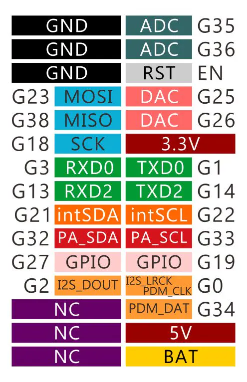
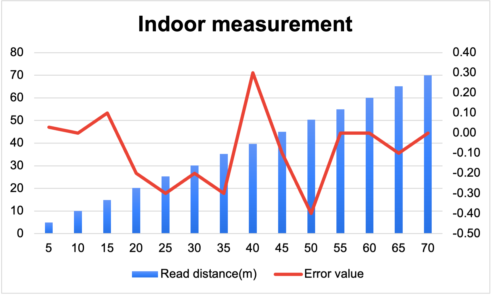
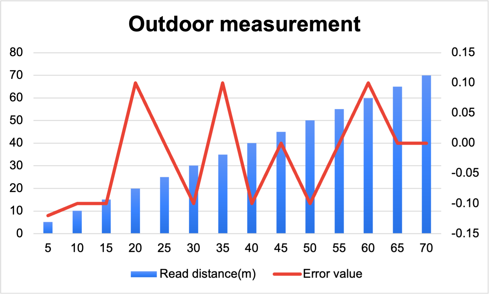

## M5Stack Core2 UWB (DW1000/BU01) Examples

Arduino sketches for using an M5Stack Core2 with an Ai-Thinker BU01 UWB (Decawave DW1000) module to measure distance and perform simple 2D positioning.

### What’s inside
- Distance measurement with one Tag and up to three Anchors
- On-screen UI on the M5Core2 (distances, status)
- A simple two-anchor positioning example that computes an (x, y) from two distances

---

## Hardware

### Required
- M5Stack Core2
- Ai-Thinker UWB BU01 (DW1000) module
- 4× Dupont jumpers (male–female)
- USB-C cable

### Wiring (UART2)
Connect BU01 to the Core2 as follows:
- GND → GND
- 5V → 5V
- BU01 RXD → Core2 TXD2 (ESP32 GPIO17)
- BU01 TXD → Core2 RXD2 (ESP32 GPIO16)

Pin reference diagrams:




---

## Software setup

1) Install Arduino IDE and M5Stack Core2 board support
- Follow the official guide: https://docs.m5stack.com/en/quick_start/m5core/arduino
- Install the `M5Core2` library from Library Manager

2) Serial settings
- All sketches use `Serial2` at 115200 baud for the BU01

---

## Repository structure

```
Distance measurement/
  M5andDW1000_distance_tag/
  M5andDW1000_distance_anchor_0/
  M5andDW1000_distance_anchor_1/
  M5andDW1000_distance_anchor_2/
  M5andDW1000BasicReceiver/
Position/
  M5andDW1000_Two_point_positioning_Kuo/
Document/           # Datasheets, photos, diagrams
lib/                # Vendor SDK and resources
LICENSE
README.md
```

---

## How to run

### A) Distance measurement (Tag + Anchors)
You need one device configured as a Tag and one or more as Anchors.

1) Flash Tag
- Open and upload: `Distance measurement/M5andDW1000_distance_tag/M5andDW1000_distance_tag.ino`
- The sketch sends these AT commands to BU01: `AT+anchor_tag=0`, `AT+interval=30`, `AT+switchdis=1`, then `AT+RST`

2) Flash Anchors (IDs 0, 1, 2)
- Open and upload to separate Core2 devices:
  - `Distance measurement/M5andDW1000_distance_anchor_0/M5andDW1000_distance_anchor_0.ino`
  - `Distance measurement/M5andDW1000_distance_anchor_1/M5andDW1000_distance_anchor_1.ino`
  - `Distance measurement/M5andDW1000_distance_anchor_2/M5andDW1000_distance_anchor_2.ino`
- Each anchor sketch issues `AT+anchor_tag=1,<ID>` and `AT+RST`

3) Observe distances
- The Tag device displays per-anchor distance readings on its screen
- Serial monitor (115200) also logs data

### B) Basic receiver (anchor-style)
- Open and upload: `Distance measurement/M5andDW1000BasicReceiver/M5andDW1000BasicReceiver.ino`
- Useful for verifying connectivity; shows setup status and tag presence

### C) Two-point positioning demo
- Open and upload: `Position/M5andDW1000_Two_point_positioning_Kuo/M5andDW1000_Two_point_positioning_Kuo.ino`
- Assumes two anchors at fixed points: (0, 0) and (2.0, 0) with 2.0 m separation
- Calculates the Tag’s (x, y) using the two measured ranges

---

## Results





In testing, the system maintained high accuracy over longer distances for line-of-sight.

---

## Troubleshooting
- If you see “Can't find the tag!!!” on an anchor, ensure the Tag is powered and broadcasting
- Tap the Reset action (`AT+RST`) from sketches if modules lose sync
- Verify TX/RX wiring is not swapped and baud is 115200

---

## License

MIT — see `LICENSE` for details.

## Acknowledgements
- Built with Arduino and M5Stack Core2 libraries
- Uses Ai-Thinker BU01 (DW1000) UWB module; includes vendor SDK in `lib/`
